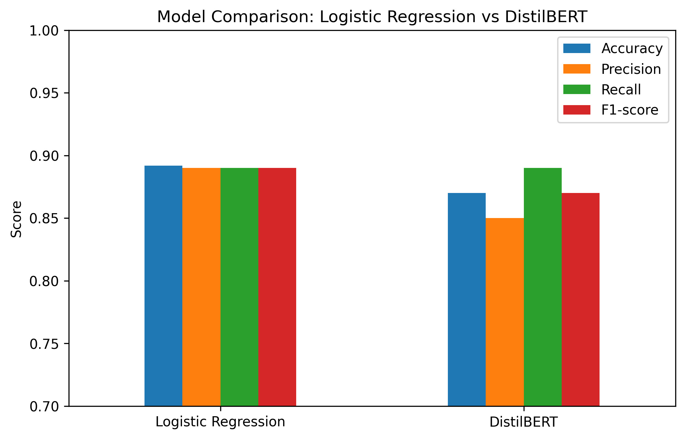

# NLP Sentiment Analysis with IMDb Reviews

## 📑 Overview
This project explores sentiment analysis using IMDb reviews dataset.
We compare:
- **Logistic Regression + TF-IDF** (baseline)
- **DistilBERT fine-tuning** (transfer learning)

## 📂 Project Structure
```
nlp-sentiment-analysis/
├── .venv/
├── .vscode/
│ └── settings.json
├── data/
│ ├── processed/
│ │ ├── test.csv
│ │ ├── train.csv
│ │ └── valid.csv
│ └── raw/
├── notebooks/
│ ├── results/
│ ├── 01_data_eda.ipynb                     # Exploratory data analysis
│ ├── 02_baseline_model.ipynb               # Logistic Regression baseline
│ ├── 03_transformer_model.ipynb            # DistilBERT fine-tuning
│ └── 04_evaluation_and_reporting.ipynb     # Comparison & reporting
├── reports/
│ └── figures/
│ └── model_comparison.png
├── src/
├── .gitattributes
├── .gitignore
├── README.md
└── requirements.txt
```

## ⚙️ Setup
1. Clone this repository
```
git clone https://github.com/EddChi/nlp-sentiment-analysis.git
cd nlp-sentiment-analysis
```
2. Create and activate a virtual environment
Windows (PowerShell):
```
python -m venv .venv
.venv\Scripts\Activate.ps1
```
Mac/Linux:
```
python3 -m venv .venv
source .venv/bin/activate
```
3. Install dependencies
```pip install -r requirements.txt```
4. Launch Jupyter Notebook
Navigate to the `notebooks/` folder to run each stage of the project.

## 📊 Notebooks

**01_data_eda.ipynb**
- Load IMDB dataset
- Explore class balance, review lengths, sample text

**02_baseline_model.ipynb**
- Feature extraction with TF–IDF
- Logistic Regression classifier
- Accuracy ~89%

**03_transformer_model.ipynb**
- Tokenisation with DistilBERT tokenizer
- Fine-tuned DistilBERT for sentiment classification
- Accuracy ~87% (subset, 2 epochs)

**04_evaluation_and_reporting.ipynb**
- Aggregate results
- Compare Logistic Regression vs DistilBERT (Accuracy, Precision, Recall, F1)
- Visualisation + analysis
- Discussion on trade-offs and future improvements

## 📈 Results  

| Model                   | Accuracy | Precision | Recall | F1   |
|-------------------------|----------|-----------|--------|------|
| Logistic Regression     | 0.892    | 0.89      | 0.89   | 0.89 |
| DistilBERT (subset, 2e) | 0.870    | ~0.86     | ~0.87  | ~0.87 |



## 🚀 Future Work
- Train DistilBERT on full dataset
- Try BERT-base / RoBERTa
- Advanced evaluation (confusion matrices, ROC-AUC)
- Inference script for new reviews

## 📜 License
This project is licensed under the [MIT License](LICENSE).